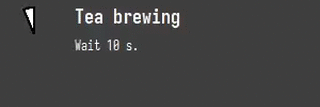

## Wintea

Simple countdown program displaying time remaining until your tea is ready.



[Download latest release](https://github.com/Bleskocvok/wintea/releases/latest)

You can download the executable file (`tea.exe`), place it somewhere and run it to begin
countdown.

It can be run from powershell as follows to begin countdown for 5 minutes:

```ps
.\tea.exe 5:00
```

It can also be run by double-clicking in which case the program prompts for
time which is entered in the same format.

### WSL

Originally intended to be used inside WSL. In that case, the `install.sh` script
should be followed as it places files in the appropriate places. The script
compiles the source code, so it expects that you have setup development
environment (either MinGW or MSVC and Python3 and ImageMagick).

In WSL (using MinGW):
```sh
git clone https://github.com/Bleskocvok/wintea.git
cd wintea
sh ./install.sh
```

Using MSVC:
```sh
git clone https://github.com/Bleskocvok/wintea.git
cd wintea
USING_MINGW=0 sh ./install.sh
```

After installation succeeds, you can run the program from the command line in
WSL (assuming you have made sure to have `~/bin` in the `PATH` environment
variable).
```sh
tea 5:00
tea
```

If WSL doesn't find the `tea` command, that probably means the `PATH`
environment variable doens't contain `~/bin`. To fix that, you can simply run
this (assuming you are using `bash` (if you aren't, you probably already know
what is going on and can set it up yourself)).
```sh
echo 'export PATH="$HOME/bin:$PATH"' >> ~/.bashrc
```

### Customization

The appearance of the countdown window can be customized using environment
variables. All sizes are in pixels. Colors are in html notation, e.g.: `#ff00ff`
which would be pink.

- `WINTEA_WIDTH` – Width of the window
- `WINTEA_HEIGHT` – Height of the window
- `WINTEA_DX` – Position of the window relative to the left side (or the right side if negative)
- `WINTEA_DY` – Position of the window relative to top border (or the bottom one if negative)
- `WINTEA_ICON_SIZE` – Size of icon
- `WINTEA_WAIT_STYLE_FONT` – Name of font to show countdown message
- `WINTEA_WAIT_STYLE_FG` – Color of text to show countdown message
- `WINTEA_WAIT_STYLE_BG` – Color of background during countdown
- `WINTEA_READY_STYLE_FONT` – Name of font to show final message
- `WINTEA_READY_STYLE_FG` – Color of text to show final message
- `WINTEA_READY_STYLE_BG` – Color of background after countdown is done
- `WINTEA_WAIT_TEXT` – Title to show during countdown
- `WINTEA_READY_TEXT` – Title to show after countdown is done
- `WINTEA_WAIT_DESC` – Description to show after countdown is done
- Title text rectangle coordinates
    - `WINTEA_TITLE_RECT_X_LEFT`
    - `WINTEA_TITLE_RECT_Y_TOP`
    - `WINTEA_TITLE_RECT_X_RIGHT`
    - `WINTEA_TITLE_RECT_T_BOTTOM`
- Description text rectangle coordinates
    - `WINTEA_DESC_RECT_X_LEFT`
    - `WINTEA_DESC_RECT_Y_TOP`
    - `WINTEA_DESC_RECT_X_RIGHT`
    - `WINTEA_DESC_RECT_Y_BOTTOM`
